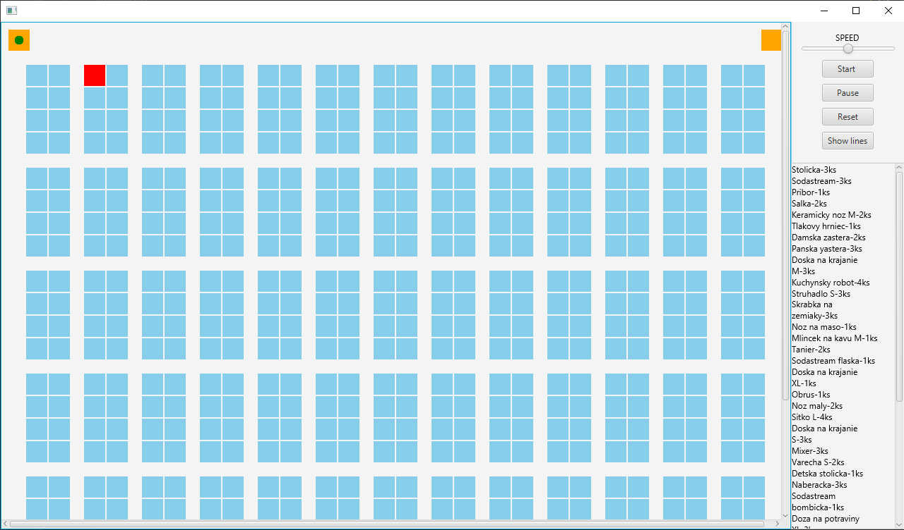
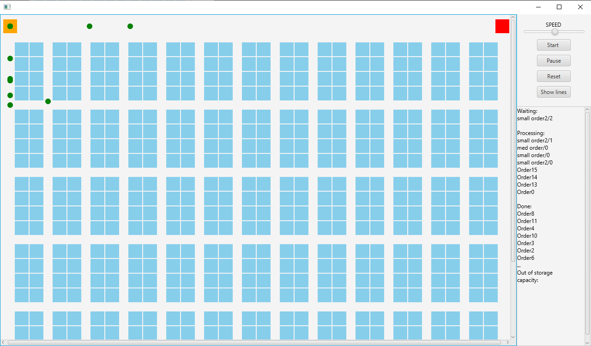
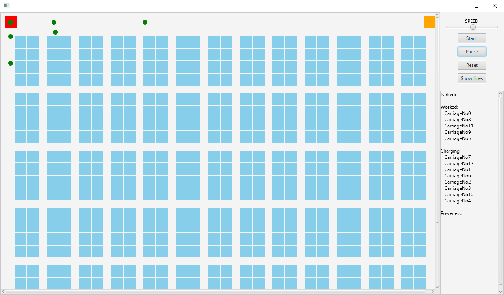
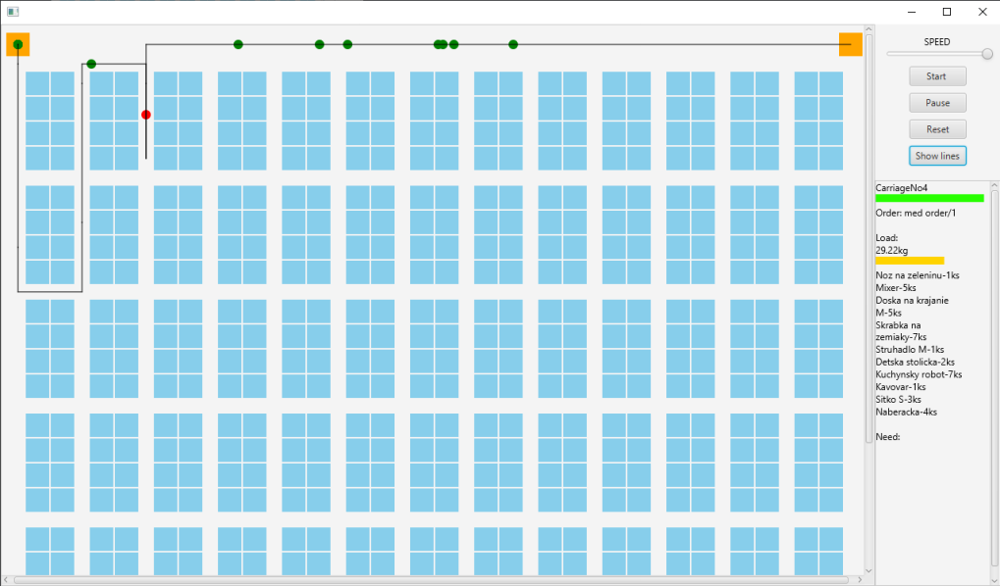

# Java - projekt
## skladisko
 ---

### autori
 - Jakub Sokolik
 - Matúš tvarožný

### Nástroje
  - Java 8
  - JavaFx
  - SceneBuilder
  - Gradle
  - yaml

### popis
Úlohou bolo navrhnuť a naimplementovať skladisko. Skladisko obsahuje vozíky, ktoré vyberajú tovar z regálov.

### ukážka skladiska
Polica s obsahom:

Spracovanie objednávok:

Ukažka vozíka:

Trasa vozíka: 

